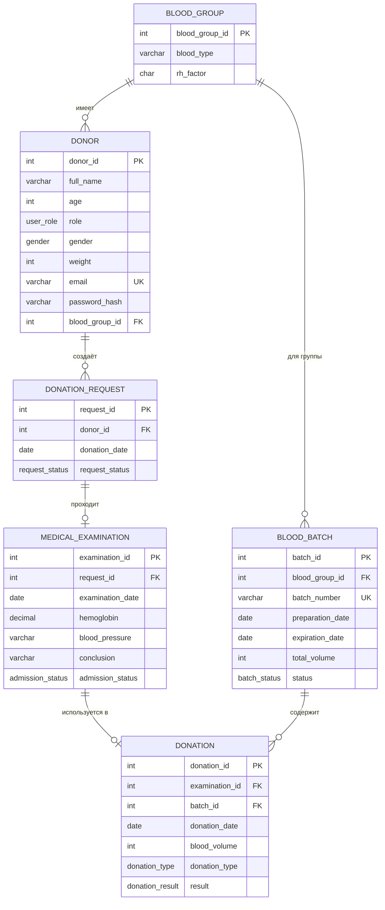

# ER-диаграмма базы данных

Диаграмма соответствует текущей схеме из `sql_script/blood_donor.sql`.

Ограничение `UNIQUE` на `medical_examination.request_id` означает, что у одной заявки может быть не более одного обследования. 
Ограничение `UNIQUE` на `donation.examination_id` реализует правило «одно положительное обследование — одна донация».
